# Laboratorio GitHub Actions

En este laboratorio se practican conceptos básicos de **CI/CD con GitHub Actions**.

Se trabajará sobre el proyecto **Hangman** utilizado en clase.

Se crear workflows para:

- Hacer la build de un proyecto
- Ejecutar tests unitarios
- Construir imágenes Docker
- Publicar imágenes Docker en un registry
- Ejecutar tests end‑to‑end

## Entrega del laboratorio

Este laboratorio se entrega a través del siguiente **repositorio público en GitHub:**.

```
https://github.com/SergioSanchezMartin/github-actions-lab
```

El repositorio contiene:

```
.github/workflows/
<el código fuente proporcionado>
README.md
```

## Ejercicio 1. Workflow CI para el proyecto de frontend

**En este ejercicio se trabaja sobre el proyecto de [frontend](./code/hangman-front/).**

**El objetivo es crear un nuevo workflow que se dispare cuando haya cambios en el proyecto `hangman-front` y exista una nueva pull request (deben darse las dos condiciones a la vez). El workflow ejecutará las siguientes operaciones:**
- **Build del proyecto**
- **Ejecución de los test unitarios**

---

### Estructura necesaria para GitHub Actions

Para realizar este ejercicio voy a trabajar en una nueva rama llamada **`ci-front-workflow`**. En ella se añadirá un workflow de **GitHub Actions** encargado de comprobar automáticamente que el proyecto de frontend funciona correctamente antes de integrar cambios en la rama principal.

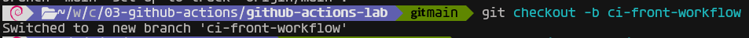

Los workflows de GitHub Actions deben almacenarse dentro del repositorio en la siguiente ruta:

**`.github/workflows/`**

Por tanto, lo primero será crear esta estructura de carpetas en la raíz del proyecto. Dentro de esa carpeta se guardarán los ficheros de configuración de los workflows, normalmente con extensión **`.yml`** o **`.yaml`**.

En este caso, como vamos a crear un workflow de integración continua, el fichero se llamará:

**`ci-front.yaml`**

---

### Configuración del fichero `ci-front.yaml`

#### Nombre del workflow

El primer paso consiste en asignar un nombre descriptivo al workflow. En este caso se utilizará el nombre:

**`CI-front`**

```yaml
name: CI-front
```

---

### Evento que activa el workflow

A continuación se configura la sección **`on`**, que indica en qué situaciones debe ejecutarse el workflow.

Como el ejercicio pide que se lance cuando haya cambios en el proyecto hangman-front y exista una pull request sobre la rama **`main`**, se utilizarán los eventos **`pull_request`** y **`push`** junto con los filtros **`branches`** y **`paths`**.

De esta forma, GitHub Actions solo ejecutará el workflow cuando la pull request incluya modificaciones dentro de esa carpeta:

La configuración quedaría reflejada como se muestra a continuación:

```yaml
on:
  pull_request:
    branches: [ main ]
    paths: [ 'code/hangman-front/**' ]
  # Añadimos el caso push
  push:
    branches: [ main ]
    paths: [ 'code/hangman-front/**' ]
```

---

### Definición de los jobs

La sección **`jobs`** permite indicar las tareas que se van a ejecutar dentro del workflow.

En este ejercicio se necesitan dos trabajos diferentes:

- **`build`**, encargado de construir el proyecto.
- **`test`**, encargado de ejecutar los test unitarios.

---

### Job `build`

El primer job se encargará de compilar o construir el proyecto de frontend.

En primer lugar, se indica el sistema operativo sobre el que se ejecutará el workflow. Para ello se utiliza la propiedad **`runs-on`** con el valor:

```yaml
runs-on: ubuntu-latest
```

Esto significa que GitHub Actions usará una máquina virtual con la última versión disponible de Ubuntu.

Después se definen los pasos dentro de la sección **`steps`**.

---

#### Paso 1: recuperar el código del repositorio

El primer paso consiste en descargar el código fuente del repositorio dentro de la máquina virtual donde se ejecuta el workflow.

Para ello se usa la acción oficial:

```yaml
actions/checkout@v6
```

El paso quedaría configurado así:
```yaml
jobs:
  build:
    runs-on: ubuntu-latest
    steps:
    - name: Checkout
      uses: actions/checkout@v6
```

Esta acción permite que el workflow pueda acceder a los ficheros del proyecto.

---

#### Paso 2: configurar Node.js

El proyecto necesita Node.js para instalar dependencias, construir la aplicación y ejecutar los test.

Por ese motivo, el siguiente paso consiste en preparar la versión de Node.js que se va a utilizar. Para ello se emplea la acción:

En este caso se configurará Node.js en su versión 18:

```yaml
- name: Setup Node.js version
  uses: actions/setup-node@v6
  with:
    node-version: 18
```

---

#### Paso 3: construir el proyecto

Una vez disponible el código y configurado Node.js, se ejecuta la construcción del proyecto.

Como el fichero `package.json` no se encuentra en la raíz del repositorio, sino dentro de la carpeta **`hangman-front`**, es necesario indicar el directorio de trabajo mediante:

```yaml
- name: Build
  working-directory: ./code/hangman-front
```

Dentro de ese directorio se ejecutarán los comandos necesarios:

1. Instalar las dependencias.
2. Lanzar el script de build.

El paso quedaría como se muestra a continuación:

```yaml
- name: Build
    working-directory: ./code/hangman-front
    run: |
      npm ci
      npm run build --if-present
```

Con esto quedaría terminado el job **`build`**.

---

### Job `test`

El segundo job se encargará de ejecutar los test unitarios del proyecto.

Este job también se ejecutará sobre una máquina Ubuntu 22.04:

```yaml
runs-on: ubuntu-22.04
```

Además, interesa que los test se ejecuten después de que el proyecto se haya construido correctamente. Para establecer esa dependencia se utiliza:

```yaml
needs: build
```

De esta manera, el job **`test`** no comenzará hasta que el job **`build`** haya finalizado sin errores.

---

### Pasos del job `test`

Este job tendrá una estructura muy parecida al job anterior.

Los dos primeros pasos serán los mismos:

1. Recuperar el código del repositorio con **`actions/checkout@v6`**.
2. Configurar Node.js con **`actions/setup-node@v6`**.

El tercer paso será diferente, ya que en lugar de construir el proyecto se ejecutarán los test unitarios.

Para ello, de nuevo se indica como directorio de trabajo. A continuación se instalan las dependencias y se ejecuta el comando correspondiente a los test.

El paso final quedaría así:

```yaml
- name: Unit tests
        working-directory: ./code/hangman-front
        run: |
          npm ci
          npm run test
```

---

### Resultado final del workflow

Una vez configurados todos los apartados anteriores, el fichero **`ci-front.yaml`** contendrá el workflow completo de integración continua.

Su aspecto final será similar al siguiente:

```yaml
name: CI-front

on:
  pull_request:
    branches: [ main ]
    paths: [ 'code/hangman-front/**' ]
  push:
    branches: [ main ]
    paths: [ 'code/hangman-front/**' ]

jobs:
  build:
    runs-on: ubuntu-latest

    steps:
    - name: Checkout
      uses: actions/checkout@v6
    - name: Setup Node.js version
      uses: actions/setup-node@v6
      with:
        node-version: 18
    - name: Build
      working-directory: ./code/hangman-front
      run: |
        npm ci
        npm run build --if-present

  test:
    runs-on: ubuntu-22.04
    needs: build

    steps:
      - name: Checkout
        uses: actions/checkout@v6
      - name: Setup Node.js version
        uses: actions/setup-node@v6
        with:
          node-version: 18
      - name: Unit tests
        working-directory: ./code/hangman-front
        run: |
          npm ci
          npm run test
```

---

### Comprobación del workflow

Para verificar que el workflow funciona correctamente, se realiza un cambio dentro del proyecto **`hangman-front`**.

Por ejemplo, se puede modificar temporalmente un fichero como **`app.tsx`**, añadiendo un pequeño comentario. Después se suben los cambios al repositorio mediante un **`push`**.

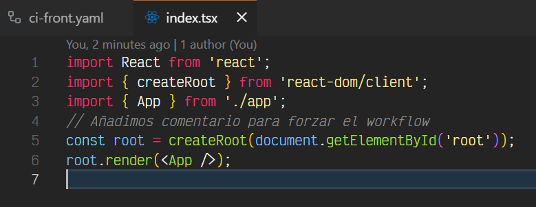

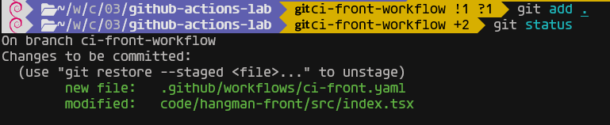

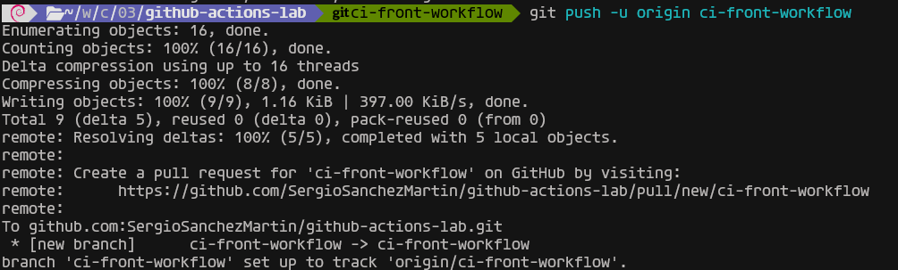

Una vez subidos los cambios, GitHub muestra las diferencias entre la rama actual y la rama **`main`**.

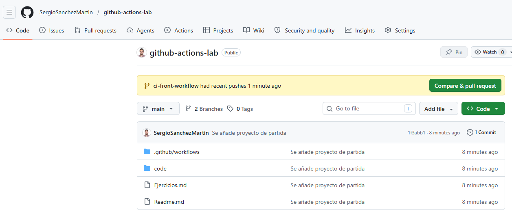

A continuación se pulsa el botón **`Compare & pull request`** para crear la pull request.

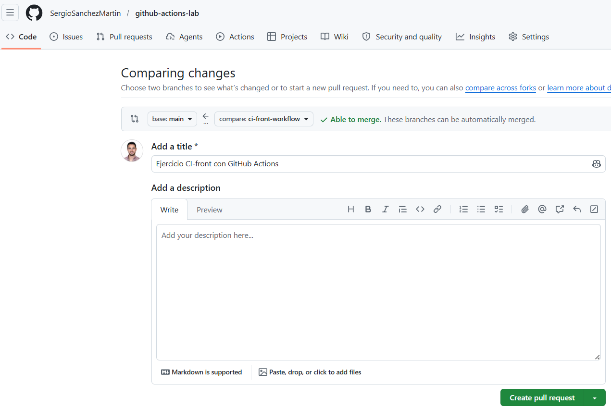

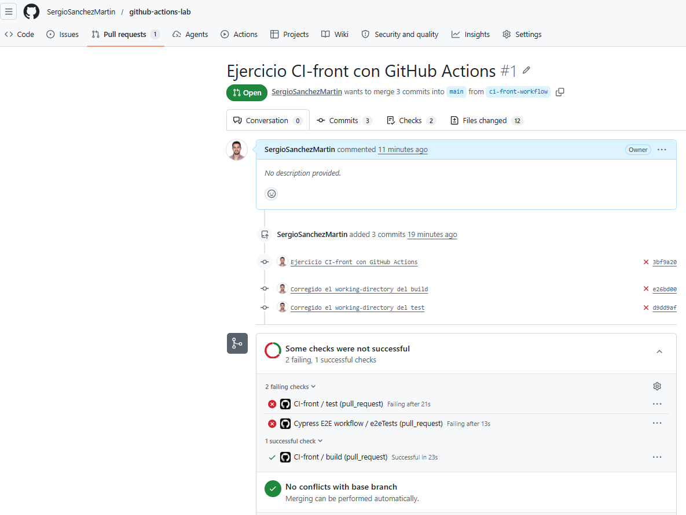

Como la pull request contiene cambios dentro de **`hangman-front`**, se cumplen las condiciones necesarias y el workflow se ejecuta automáticamente.

Desde la pestaña **Actions** se puede consultar el estado de la ejecución.

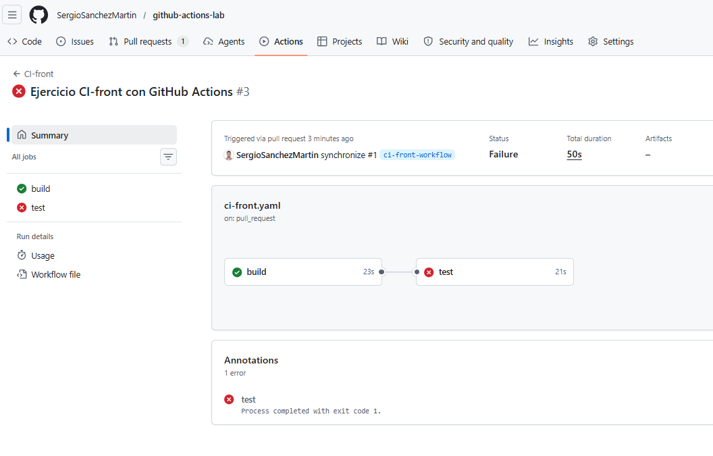

---

### Revisión de errores

Durante la primera ejecución se observa que el job de test ha fallado. En este caso, espera un array de 1 posición pero se reciben 2.

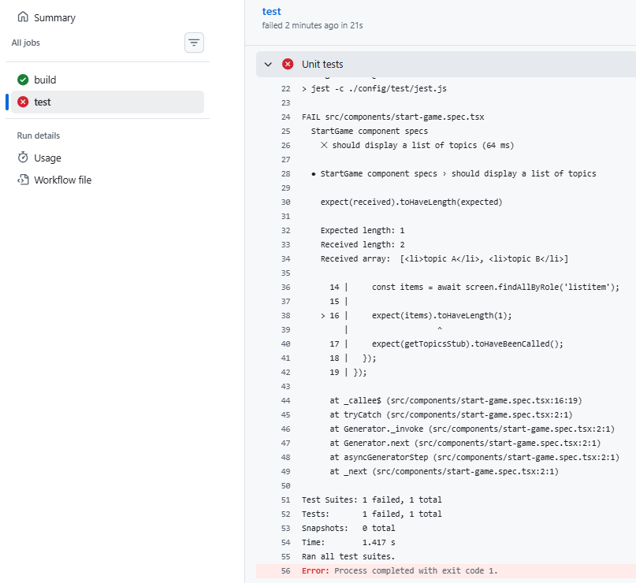

Para corregirlo, se revisa el error indicado por GitHub Actions y se realizan los cambios necesarios desde Visual Studio Code.

```tsx
expect(items).toHaveLength(2);
```

Además, se elimina el comentario temporal que se había añadido para provocar el cambio inicial.

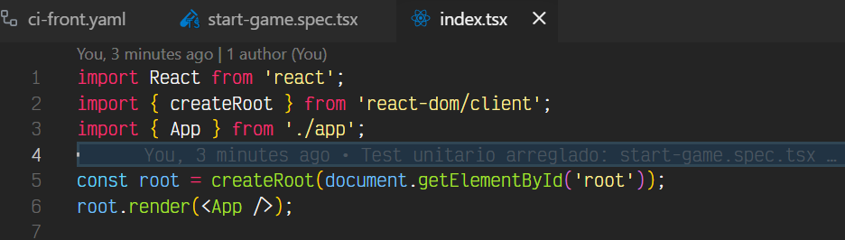

Después se vuelven a subir los cambios al repositorio.

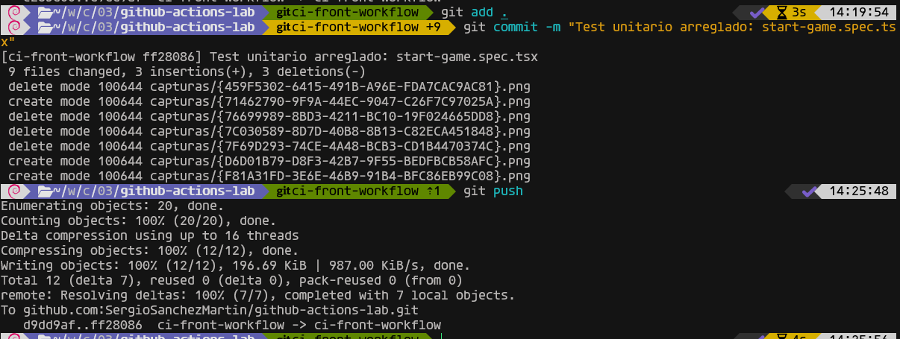

Al actualizarse la pull request, GitHub Actions ejecuta de nuevo el workflow. En esta segunda ejecución se comprueba que el proceso finaliza correctamente.

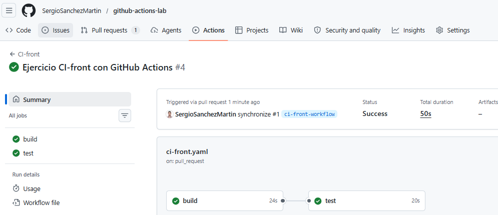

---

### Finalización de la pull request

Una vez comprobado que el workflow se ejecuta sin errores, se puede hacer el **merge** de la pull request.

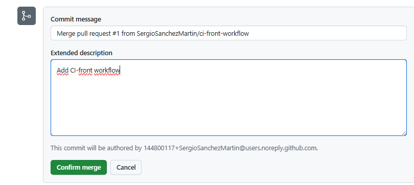

En este caso, la rama no se elimina para que pueda consultarse posteriormente en el repositorio.

Por último, se vuelve a la rama **`main`** en el entorno local y se ejecuta un **`pull`** para actualizar el proyecto y dejarlo preparado para el siguiente ejercicio.


## 2. Workflow CD para el proyecto de frontend

**El objetivo es crear un nuevo workflow que se dispare manualmente y haga lo siguiente:**

- **Crear una nueva imagen de Docker**
- **Publicar dicha imagen en el [container registry de GitHub](https://docs.github.com/en/packages/working-with-a-github-packages-registry/working-with-the-container-registry)**

> **Nota: se usan las actions de Docker vistas en clase**

En este ejercicio se trabajará directamente sobre la rama **`main`**.

Para ello, dentro de la carpeta **`.github/workflows/`** se creará un nuevo fichero llamado **`cd-front.yaml`**. En este archivo se definirá el workflow encargado de construir y publicar la imagen Docker.

---

### Contenido del fichero `cd-front.yaml`

#### Nombre del workflow

Lo primero que se debe hacer es asignar un nombre al workflow. En este caso se utilizará el siguiente:

**`CD-front`**

```yaml
name: CD-front
```

Este nombre será el que aparecerá posteriormente en la pestaña **Actions** del repositorio.

---

### Ejecución manual del workflow

A continuación se debe configurar la sección **`on`**, donde se indican los eventos que provocan la ejecución del workflow.

En este caso, el workflow no se lanzará automáticamente con un `push` o una `pull request`, sino que deberá ejecutarse manualmente. Para ello se utiliza el evento:

```yaml
name: CD-front

on:
  workflow_dispatch:
```

---

### Definición del job principal

Después de indicar cuándo se ejecutará el workflow, se deben definir los **jobs**.

En este ejercicio solo se necesita un job, que será el encargado de construir la imagen Docker y publicarla en el registro de contenedores de GitHub.

El job se llamará:

**`buildAndPushImage`**

---

### Job `buildAndPushImage`

Este job será el responsable de preparar el entorno, iniciar sesión en el registro de contenedores, construir la imagen y publicarla.

Lo primero que se indica dentro del job es la máquina virtual donde se ejecutará. En este caso se utilizará la última versión disponible de Ubuntu:

```yaml
runs-on: ubuntu-latest
```

A continuación se definen los pasos dentro de la sección **`steps`**.

---

#### Paso 1: descargar el código del repositorio

El primer paso consiste en recuperar el código fuente del repositorio para que el workflow pueda acceder a los ficheros del proyecto.

Para ello se utiliza la acción oficial de GitHub:

```yaml
uses: actions/checkout@v6
```

Este paso se puede llamar **`Checkout`**.

---

#### Paso 2: iniciar sesión en GitHub Container Registry

Una vez disponible el código del repositorio, el siguiente paso consiste en iniciar sesión en el **GitHub Container Registry**.

Para ello se utiliza la action de Docker vista en clase:

```yaml
uses: docker/login-action@v4
```

Antes de configurar este paso, se puede consultar la documentación de la action **[Docker Login](https://github.com/marketplace/actions/docker-login#github-container-registry)** en el Marketplace de GitHub, concretamente en el apartado correspondiente a **GitHub Container Registry**.


Este paso se llamará:

**`Login to GitHub Container Registry`**

La action necesita varios parámetros dentro de la sección **`with`**:

```yaml
registry: ghcr.io
username: ${{ github.actor }}
password: ${{ secrets.GITHUB_TOKEN }}
```

El significado de estos valores es el siguiente:

- **`registry: ghcr.io`** indica que se va a iniciar sesión en el registro de contenedores de GitHub.
- **`username: ${{ github.actor }}`** utiliza como usuario la cuenta que ejecuta el workflow.
- **`password: ${{ secrets.GITHUB_TOKEN }}`** utiliza el token generado automáticamente por GitHub para autenticar la operación.

El paso quedaría configurado así:

```yaml
- name: Login to GitHub Container Registry
  uses: docker/login-action@v4
  with:
    registry: ghcr.io
    username: ${{ github.actor }}
    password: ${{ secrets.GITHUB_TOKEN }}
```

---

### Permisos del workflow

Para que el workflow pueda publicar imágenes en el **GitHub Container Registry**, es necesario comprobar los permisos del repositorio.

Desde la documentación de la action **Docker Login** se indica que puede ser necesario habilitar permisos de lectura y escritura para GitHub Actions.

Para configurarlo, se deben seguir estos pasos:

1. Acceder a **Settings** dentro del repositorio.
2. Entrar en el apartado **Actions**.
3. Seleccionar la opción **General**.
4. Buscar la sección **Workflow permissions**.
5. Marcar la opción **Read and write permissions**.
6. Guardar los cambios con el botón **Save**.

La configuración quedaría como se muestra a continuación:

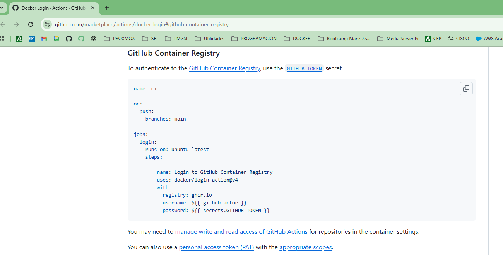

---

### Construcción y publicación de la imagen Docker

Para los siguientes pasos se utilizará la action vista en clase para construir y publicar imágenes Docker:

```yaml
- name: Setup Docker Buildx
  uses: docker/setup-buildx-action@v4
```

Esta action permite crear una imagen Docker a partir de un `Dockerfile` y, además, publicarla directamente en un registro de contenedores.

La documentación del [Marketplace de GitHub](https://github.com/marketplace/actions/build-and-push-docker-images#path-context) muestra cómo utilizar esta action:

---

### Paso de build y push

El último paso del workflow será el encargado de construir la imagen Docker y subirla al **GitHub Container Registry**.

Para ello se deben configurar varios argumentos:

```yaml
- name: Build and push Docker Image
  uses: docker/build-push-action@v7
  with:
    context: ./code/hangman-front
    push: true
    tags: ghcr.io/sergiosanchezmartin/hangman-front:latest
    file: ./code/hangman-front/Dockerfile
```

Estos valores tienen el siguiente significado:

- **`context: ./code/hangman-front`** indica que el contexto de construcción de la imagen será la carpeta del proyecto frontend.
- **`push: true`** indica que, además de construir la imagen, también debe publicarse en el registro.
- **`tags`** define el nombre completo de la imagen que se va a publicar.
- **`file`** indica la ruta donde se encuentra el fichero **`Dockerfile`**.

El nombre de la imagen debe comenzar por:

```yaml
ghcr.io
```

Después se indica el usuario o propietario del repositorio en GitHub, el nombre de la imagen y la etiqueta correspondiente.

---

### Resultado final del fichero `cd-front.yaml`

Una vez configuradas todas las secciones anteriores, el fichero **`cd-front.yaml`** contendrá el workflow completo de despliegue continuo.

El aspecto final del fichero sería similar al siguiente:

```yaml
name: CD-front

on:
  workflow_dispatch:

jobs:
  buildAndPushImage:
    runs-on: ubuntu-latest

    steps:
      - name: Checkout
        uses: actions/checkout@v6
      - name: Login to GitHub Container Registry
        uses: docker/login-action@v4
        with:
          registry: ghcr.io
          username: ${{ github.actor }}
          password: ${{ secrets.GITHUB_TOKEN }}
      - name: Setup Docker Buildx
        uses: docker/setup-buildx-action@v4
      - name: Build and push Docker Image
        uses: docker/build-push-action@v7
        with:
          context: ./code/hangman-front
          push: true
          tags: ghcr.io/sergiosanchezmartin/hangman-front:latest
          file: ./code/hangman-front/Dockerfile
```

---

### Ejecución manual del workflow

Una vez creado el workflow, el siguiente paso consiste en probar que funciona correctamente.

Para ejecutarlo manualmente, se deben seguir estos pasos:

1. Hacer `push` de los cambios.
2. Acceder a la pestaña **Actions** del repositorio.
3. Seleccionar el workflow **Despliegue continuo**.
4. Pulsar el botón **Run workflow**.
5. Seleccionar la rama sobre la que se quiere ejecutar. En este caso, **`main`**.
6. Pulsar de nuevo sobre **Run workflow** para iniciar la ejecución.

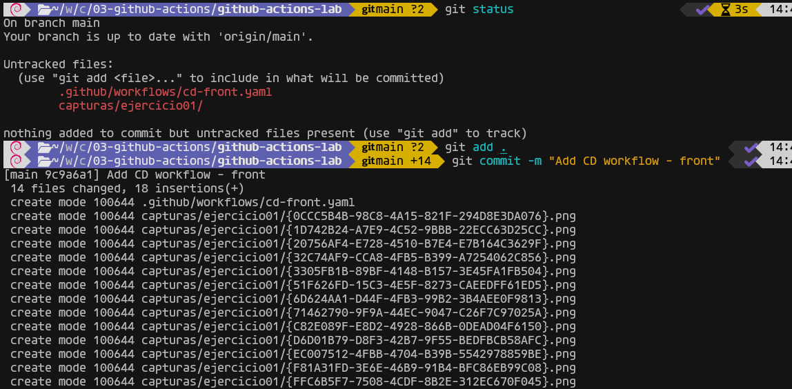

Como el workflow se ha configurado con **`workflow_dispatch`**, GitHub permite lanzarlo manualmente desde esta pantalla.

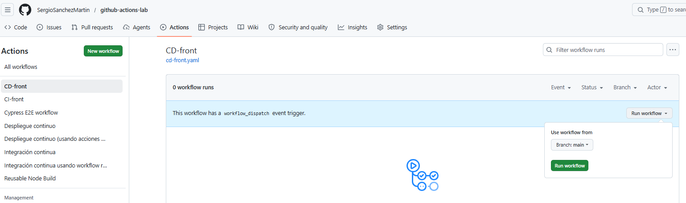

---

### Comprobación de la ejecución

Después de lanzar el workflow, GitHub Actions ejecutará todos los pasos definidos en el fichero **`cd-front.yaml`**.

Si todo está correctamente configurado, los pasos finalizarán sin errores y el workflow aparecerá como ejecutado correctamente.

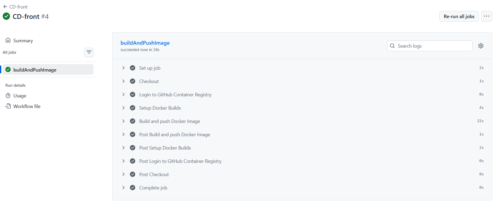

---

### Comprobación de la imagen publicada

Para confirmar que la imagen se ha publicado correctamente, se debe acceder al perfil de GitHub y entrar en la pestaña **Packages**.

En esta sección aparecerán los paquetes asociados a la cuenta o al repositorio. Si el workflow se ha ejecutado correctamente, la imagen Docker creada en el ejercicio aparecerá publicada en el **GitHub Container Registry**.

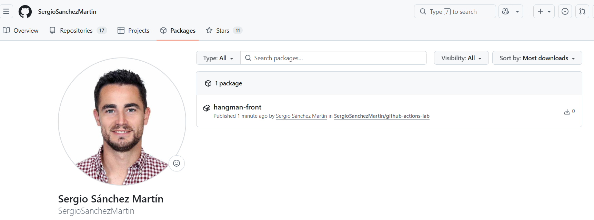

## 3. Workflow para ejecutar tests E2E (opcional)

**El objetivo es crear un workflow que se lance de la manera que elijamos y ejecute los tests e2e que encontrarás en [este enlace](https://github.com/Lemoncode/bootcamp-devops-lemoncode/tree/master/03-cd/03-github-actions/.start-code/hangman-e2e/e2e). Se puede usar [Docker Compose](https://docs.docker.com/compose/gettingstarted/) o [Cypress action](https://github.com/cypress-io/github-action) para ejecutar los tests.**
